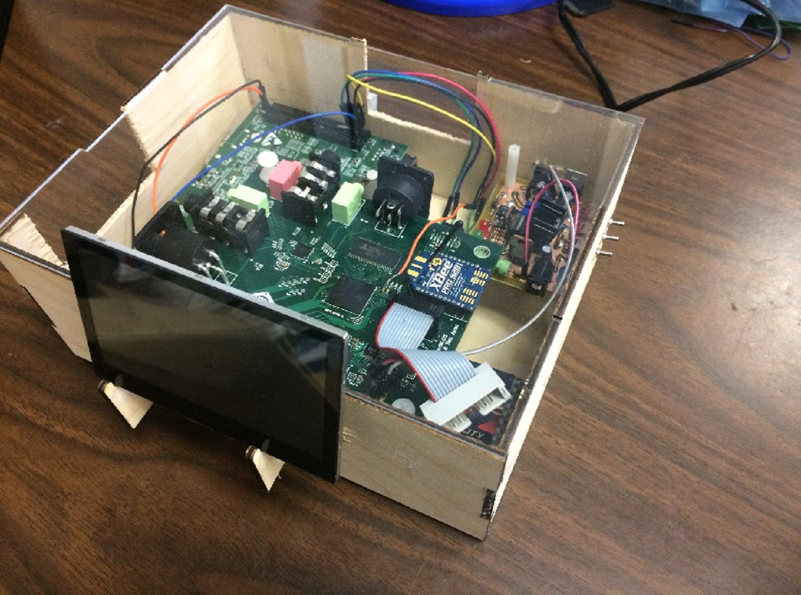

+-------------------------+-------------------------+
| Mark McNeely\           | Raz Aloni\              |
| Electrical Engineer     | Computer Engineer       |
|                         |                         |
| Secretary, Eta Kappa Nu | President, Eta Kappa Nu |
|                         |                         |
| University of Florida   | University of Florida   |
+-------------------------+-------------------------+

Project Abstract
================

"Mic Check" is a real-time vocal Auto-Tuner and Auto-Harmonizer. Live
audio effect systems are nothing new in the music industry, however they
are usually more focused towards electronic instruments such as electric
guitars and synthesizers, while vocal effect systems are primarily
applied in post-production using non-real-time calculations. This system
provides vocalists a unique interface for modifying their voice in real
time for easy configuration and fast mode changes. This project heavily
relies on real-time digital signal processing, with some analog work to
condition and acquire the audio data as well as power the system.

Hardware -- DSP Base Station
============================

The Main Processing Board was designed to run the entire system from a
single board. The complexity of the processing algorithms required a
capable processor, so the TI C6000 DSP series was selected.

Capabilities:

-   Complex Digital Signal Processing

-   Generation of 5 Voltage Power Levels

-   LCD Raster "24bit" color Display Interface

-   LCD Touch Screen I2C Interface

-   Two ADC's Capable of Managing 3 Balanced Inputs and 1 Stereo Input

-   Two DAC's pushing to 4 Audio Outputs

-   Auto-Tuning from 3.5mm and XLR Inputs

-   Audio Pass-through or Effects on 3.5mm and 1/4\" inputs

-   Audio Output on 3.5mm, 1/4\", XLR, Speaker

-   SD card Bootup and Data Transfer

-   SDRAM Data Storage

-   Wireless UART Communication over XBEE

-   Debug Switches and LEDs

-   Auto-RESET Generation during Low Power

Detailed Board Function
-----------------------

### Power sequencing generation

The DSP chip required its various power levels to be provided in
specific orders in order to power up correctly. This was accomplished
using interconnected PMOS transistors to guarantee that the voltages
would arrive in the correct order.

### Power Generation

A powerful IC complete with 3 DC/DC switching converters and 3 LDO
linear converters was used to generate the necessary voltages for the
entire board. Those voltages were 3.3V, 1.8V, 1.3V, 1.2V, 1.2V analog
isolated, and were all produced from the Zener Regulated 5V input supply
from a universal barrel plug.

### Processor

The OMAP L138 was selected as the processor for the board as a
development kit with this processor was available in order to quickly
start on software. This chip is only available in Ball Grid Array
footprints, so the device chosen was a 361ball 0.8mm pitch device.

In order to route the BGA, typically 2 layers are required to breakout
the first 4 circumference layers of balls, and then another board layer
is required for each next layer of balls to be broken out. However, the
design did not require 100% breakout of the device, so the routing was
creatively done in order to get the device working on a 4-layer board.

The standard dog-bone via structure was used for breakout of internal
pins onto the top and bottom signal layers. The second layer was used as
a ground plane, and the third layer was used as a split power plane to
bring each of the voltage levels to the processor and also assist in
connecting isolated vias unable to be routed easily on the top and
bottom.

Suggested routing specifications for a BGA of this size according to TI
was to use 5mil trace/space, or in some cases 4mil space, along with
vias of 10mil hole diameter and 18mil ring diameter. However, the
manufacturers selected required a 5mil annular ring around each via,
which constricted the minimum ring diameter to 20mil instead of 18mil.
The product of this while trying to route out the BGA is no traces can
travel between two vias in the standard dog-bone routing architecture.
In order to solve this, advantage was taken of the fact not every ball
was broken out. In doing so, the vias for each pin did not lie in the
standard direction (pointing radially from the center), but lie in
places where a large enough path was left to rout out two or three
traces on the bottom layer.

An image of the broken out BGA can be seen in Figure 13 in the appendix.

### Bypass Capacitors

Bypass capacitors are extremely important for the proper functioning of
high speed switching devices such as processors. Ideally, each power pin
should have its own capacitor for charge storage, but this is usually
impractical for very fine pin devices with a large pin count. If the
capacitors are being routed using a multi-layer format with power and
ground planes, each capacitor should have its own unshared vias to power
and ground to reduce each capacitor's series resistance. In addition,
the inductance of a board is extremely important, so the vias should be
placed as close as physically possible to the capacitor footprint. If
via-in-pad capability is available, this is preferred.

For the implementation for this project, recommendations for this device
were found from Texas Instruments, the manufacturer of the chip. They
suggested that a capacitor is only needed for each 2 power pins and each
2 ground pins, as well as a larger capacitor for each 10 power pins. In
addition, they suggested that the proximity of the capacitors to the
pins they serve is more important than each capacitor having its own
vias. Therefore, each via can support two capacitors when space is at a
premium, such as when placing directly under a broken-out BGA.
Via-in-pad technology makes this process much easier, as room under the
BGA does not need to be found for the capacitor foot prints. In order to
fit the devices, the 0402 SMT package was selected for the small
capacitors, while the large capacitors were placed around the periphery
of the chip as 0805 packages.

Most of the bypass capacitors of the processor were placed directly
under the chip, being 30 in all. These can be seen in both the design of
Figure 13 and after they were physically hand placed in Figure 19.

### Ground Isolation

In order to achieve noise free analog function, analog ground and power
rails should be separated from switching rails such as those associated
with power supplies and processors. These separated planes should be
connected at a single position in order to defeat any loop currents
which might cause noise. This connection can also be filtered with
ferrite beads and bypass capacitors in order to clean up the current
flow across the connection.

The ground planes for the switching power supply and for the Codec
device, which housed the ADC's and DAC's, was separated from the main
ground plane by use of ferrite beads.

### Overall Board Specifications

The entire board was manually routed and manually laid out, including
all via placement. The total specifications of the board are as follows:

-   361pin BGA @ 0.8mm pitch

-   Creative 4 Layer Solution

-   Minimum 5mil trace/space clearance

-   Full manual route

-   6 Power Levels

-   3 Grounds

-   Tiny 10mil vias

-   462 vias used, all manually placed

-   Mostly 0402 package SMT passives

-   Entirely hand-assembled board

-   91 Capacitors, 52 Resistors

-   2 QFN packages

-   2 TSOP packages

-   2 FPC packages

Hardware -- Wireless Button Interface
=====================================

The project included a wireless user interface board which was purposed
to be used while a performing on stage. This would enable the user to
quickly change attributes of the vocal processor without needing to
interact with the LCD display. Its buttons were to be able to be user
configured using the menu system on the LCD display, but for time
purposes each button was assigned a fixed function.

Capabilities:

-   Battery Powered by Single Cell Lithium Ion

-   Wireless Connectivity to Main DSP Board

-   Four Buttons of Configurable Function

-   RGB LED for Feedback from Main Board

-   LED Displays whether Flat or Sharp or On

Detailed board function
-----------------------

The board was controlled by an MSP430 low power processor. It was made
to receive input voltages between 3.2V and 5V DC, which were fed to an
extremely low dropout linear regulator supplying 3.3V. Below a supply
voltage of 3.2V the MSP would not power on, which was ideal as
discharging lithium ion batteries much father would require them to be
recharged in a protected, trickled manner.

The board was of minimal size, 2.5"x3", able to be held comfortably in
the hand with the small single cell battery attached to the back. It had
four buttons placed in an arc following the movement range of the thumb.
The 5mm RGB LED was placed above the buttons, centered on the board so
that it was easily viewed by the user even while actuating buttons.

In order to conserve space, the MSP and its bypass capacitors were
creatively placed directly under the footprint of the wireless module --
the XBEE PRO V2.

The working version of the board used for demonstration can be seen in
Figure 21 of the Appendix.

HARDWARE -- Battery Recharge
============================

The purpose of the main analog board of this project was threefold.
First and foremost, it was designed to provide a charging capability for
the single cell lithium ion battery used to power the wireless board.
Secondly, it was designed to provide an appropriate output which was
capable of powering the main processing board. Finally, it was made
capable of receiving input power from various sources, including
universal wall adapters and a two-cell lithium ion battery.

A notable product of including this board in the design is the
capability to use the entire system as a portable, battery powered
product.

Capabilities:

-   Single Cell Lithium Ion "Fast Charger"

-   Trickle Charging for Battery Restoration

-   Final Voltage Detection and Shutoff

-   Input Power from Wall Plug or 2Cell LiPo

-   Output Power to Main Processing Board

A block diagram of the overall analog board function may be seen in
Figure 10 of the appendix. The block diagram is also geographically
representative of the way the final board was laid out. The function of
the board is described below, working from power input to eventual power
output.

Detailed board function
-----------------------

### Power input

The power input the board was managed using a single pole, dual throw
switch where the pole continued out to the rest of the circuitry and the
throws received the two power inputs.

The main input is the 2 cell lithium ion battery, which provides between
8.4V and 7V during its "charged" portion. This input is simply pushed to
the input of the switch with only an addition of a small electrolytic
capacitor to deal with any power surges. These are likely to be
associated with sudden load application in the form of beginning a
battery charge or powering on the main processing board.

The secondary input is the 12V wall plug, which uses a barrel connector
to interface with universal AC wall adaptors. This 12V is not passed
directly to the switch, but is first stepped down and regulated by an 8V
fixed linear regulator. The regulator serves two purposes. First, it
smooths voltage supply to the rest of the system in the case that the AC
converter is unregulated. Secondly, it pulls the voltage down to a level
which is consistent with the supply range of the battery, allowing the
rest of the circuitry to be designed using a lower supply voltage. This
results in efficient sharing of heat dissipation between this 8V
regulator and the other voltage reduction elements on the device.

Attached to the output of the supply selection switch is a normally open
button which connects an LED to check if voltage is present on the
device. This power indication LED is button actuated in order to reduce
overall current draw from the device, increasing run time while under
battery power.

### battery charging

The battery charging section of the analog board is designed to deliver
102mA in a constant current charging mode for the purpose of charging a
single cell lithium ion battery. It is also capable of trickle charging
while the battery is at a critically low voltage, in accordance with the
standard lithium ion charging cycle. The charging circuit does not
implement the final constant voltage charging stage. Thus, the charger
is termed a "fast-charger" irrespective of its relatively low charging
current.

Features of the charger include the following: A toggle switch is used
in order to reduce total device current draw while the charging circuit
is not in use. A dual channel comparator device is used in conjunction
with a low power 5V regulator to compare the voltage over the charging
battery to two reference voltages produced by multi-turn, precision
potentiometers. This comparator is responsible for controlling the
binary logic inputs to the transistors responsible for controlling the
current supplied to the battery and those responsible for controlling
status charging LED's.

### Main Voltage Output

The final section of the board is simply a 5V LDO regulator which is
tasked with providing power to the main DSP board. It is connected to
both a 5.5mm barrel connector and a simple header output. Wires which
were terminated on both sides with male 5.5mm barrel connectors were
manufactured in order to interface the analog board to the main DSP
board. This way, the capability of the main board to be powered from a
lower voltage AC wall adapter would not be destroyed.

Charging circuit explaination
-----------------------------

The electronic circuit used in the function of the battery charger can
be seen in Figure 11 of the appendix.

The four most critical and necessary components for the design are the
510Ω resistor, the (red light emitting) diode in parallel with it, the
PNP BJT transistor they both are connected to, and the 4700Ω resistor
connecting the BJT base to the op amp output. If this small sub-circuit
is analyzed assuming the op amp output is pulling to ground, it can be
seen that a constant current is pulled through the diode resulting in a
clamped BJT base voltage. In the specific case seen in Figure 11, the
diode drops 1.8V between the power rail and the BJT base. Assuming the
Base-Emitter voltage of the BJT to be about 0.65V in its active state,
this leaves a **constant** 1.15V to be dropped over the resistor between
the BJT emitter and power rail regardless of current flowing through the
transistor. In other words, this is capable of supplying a constant
current at the output of the BJT dependent on the resistor value
selected to lie between the rail and the emitter. The device will
continue to push this constant current through the transistor provided
that the resulting voltage incurred on the load seen at the collector
does not overcome the headroom leftover from the supply rail.

In the case of the analog design used for this project, the actual
implementation for the current limiting resistor is a parallel
combination between the 510Ω and 10Ω resistors, where the 10Ω path is
digitally switchable using another PNP transistor. When current is
allowed only through the 510Ω path, the 1.15V drop allows roughly 2mA to
pass out of the collector of the transistor and into the battery. When
the second transistor is turned on allowing the 10Ω path to parallel the
510Ω resistor, the Voltage over the emitter to collector of the BJT can
be assumed to be small, at around 0.1 -- 0.2V This leaves about 1V to
drop over the 10Ω resistor, which will push an additional 100mA through
the main output of the constructed constant current supply, for a total
of around 102mA out the end node.

This constant current supply is pushed through a common switching diode
and then to the battery connection terminal, which goes to ground. The
battery connection is intended for a single cell lithium ion battery, so
its voltage output is monitored directly at the positive node of the
battery. A two-channel comparator takes the positive voltage and
compares it to two voltage references which are generated elsewhere
using a 5V LDO and accurate potentiometers.

The most important output of this comparator is titled "Full Voltage
Shutoff" in Figure 11, and controls the voltage at the base of the main
PNP transistor to either allow or entirely shutoff current to the
battery. The comparator output is also given to a n-FET device, which
exhibits inverse on/off characteristics to the P device. When a voltage
at or above 4.2V is detected by the main comparator, the output does
high, which shuts off the PNP device squeezing off current to the
battery and Red LED while at the same time opening the n-FET to allow
current through the Green LED.

Thus, the accessory green LED on the circuit periphery indicates when
the battery is sufficiently charged.

The other channel of the comparator works in an inverse mode. When a
battery terminal voltage below 3.1V is detected, the output goes high,
squeezing off current through the 10Ω resistor, thereby reducing current
through the output of the constant current supply. However, when a
non-dangerous LiPo voltage of above 3.1V is detected, the output is
pulled low, opening the 10Ω path and supplying full charging current to
the battery.

The purpose of the switching diode at the input to the battery terminal
is to protect the rest of the circuit from being back-powered by the
battery if the main supply voltage were to be switched off.

Both PNP BJT devices were chosen as power devices in case the maximum
charging current was decided to be increased by replacing the 10Ω
resistor with a smaller resistance in an appropriate heat dissipating
package. A maximum charging current of only 100mA through the fast path
was chosen in order to reduce heat dissipation from the device. This
avoids the need for heat sinks on either BJT and also on the 8V LDO if
wall power is used for charging.

The fact that the board as a whole can accept power from a 2-cell LiPo
means that this single cell battery charger is capable of being powered
by another battery, though this is not recommended. The charging
disconnect switch was included for the express purpose of reducing the
2-cell battery discharge rate while the Main DSP Board was running off
of battery power, thus increasing battery life.

Hardware -- lcd breakout
========================

In order for the purchased OMAP development board to interface with the
chosen LCD, a breakout board needed to be constructed. The LCD featured
two flat flexible connector (FFC) cables, one 40 pin line for the LCD
raster data and one 6 pin line for the touchscreen component, both
requiring 3.3V logic input. The LCD raster interface which was broken
out on the development board was laid out in two bays of 2x10 headers of
1.27mm pitch, in addition to being stepped down to 1.8V. (The
development board was made to interface with a specific LCD which was no
longer being manufactured.). Therefore, an LCD breakout board was
created with the proper connectors on each side and logic translation
using two 16bit level shifters of configurable byte direction, along
with a 2bit bidirectional voltage translator for use with the I2C lines.
The board also included a header for the input of the higher 25.6V
necessary to power the LCD backlight.

Software -- DSP
===============

Much of the work performed by "Mic Check" is accomplished by the
processing power of the OMAPL138 Media Processor. Although this
processor has both an ARM9 processor and C6748 DSP embedded in the chip,
only the DSP was used. Therefore, the software drivers and optimizations
explained will be relative to the C6748 Architecture.

The overall flow for the system can be seen in Figures 1, 2, and 3.

Figure 1 shows the Audio Processing Task which takes up the most CPU
time. The task will read 1024 points from a circular buffer and perform
fundamental vocal pitch detection using the Haar Wavelet transform and
threshold peak-detection. After obtaining the pitch, the closest note
will be determined by finding the closest note frequency provided in a
preset scale buffer.

At the same time, the input audio frame will be multiplied by a Hamming
Window, transformed to the frequency domain via an optimized Real Fast
Fourier Transform, and then transformed to polar values for further
processing. The audio task can create up to four voice harmonies in real
time. For each voice, the calculated closest note and input frequency
are used to calculate the pitch shift required to achieve the desired
note determined by the tuning mode the voice is configured in. After
determining the shift necessary, the shift is performed using an
overlap-stable Phase Vocoder algorithm.

Once completed, the results are accumulated into a modified frequency
buffer. After all voices have been accumulated into the modified
frequency buffer, the buffer is transformed back to rectangular form and
turned back into the time domain via an optimized Real Inverse Fast
Fourier Transform.

The resulting value is then overlap-added into an output circular buffer
where the next completed overlap (256 values) will be transferred into
the pending transmit buffer.

Figure 2 shows the process behind responding to the Capacitive touch
screen. When the screen is touched, a GPIO Hardware Interrupt will
occur, waking the LCD Touchscreen response task. The response task will
start by reading the LCD touch registers over I2C and formatting the
data into an event structure. From there it will check if the event was
a screen press and if so, it will check the touch position to see which
button was pressed.

Each button on the LCD represents a parameter that can be modified in
the preset configuration structure. This includes harmonization modes,
scale and chord keys, and number of voices. When a button is pressed,
the LCD raster frame buffer will be updated to display the modified
value. The preset configuration will also be modified and scale buffers
will be reinitialized, if needed.

Figure 3 shows the tasks responsible for interfacing with the wireless
microphone interface. One task reacts to the frequency deviation of the
voice. The task will read the determined frequency variable from the
audio task and determine how much the actual value differs from the
closest note frequency. Depending on the resulting deviation, the task
will send to the XBEE different Led Commands for the wireless microphone
interface. If the voice is sharp the led will be blue, if the pitch is
flat the led will be red, and if the frequency is within acceptable
error, the led will be green.

The other task responds to button presses from the wireless interface.
The task will wait for the UART receive hardware interrupt via
semaphore. When the semaphore is signaled, it will read the Button Queue
which holds the buttons pressed at the time of retrieval. The buttons
are responsible for changing volume and for changing presets. If the
button pressed is a volume button, the volume will be modified by 10%.
IF the button pressed is a preset button, it will modify the preset
index and update the raster frame buffer with the new preset values.

Audio Buffering Technique
-------------------------

To optimize CPU time, it is important to offload as much processing to
the DSP's peripherals as possible. One of the biggest bottlenecks for
the system is the throughput to and from the audio codec. Using the
DSP's extended DMA (EDMA) peripheral to handle block transfers of audio
over I2S allows for the CPU to spend more of its time processing data.

The buffering technique used to achieve this parallel processing is
buffer ping-ponging. The output buffer is a classic ping-pong buffer.
While the audio task is writing the processed signal to one transmit
buffer, the other one is being sent to the codec by the EDMA and MCASP.
When the transfer completes, the two transmit buffers switch.

The input buffer uses a circular variant of the Ping-Pong buffer.
Instead of two buffers, the input has eight buffers. This allows for
input history to be held to perform overlapping FFTs. While one buffer
is being populated by the EDMA, four other buffers are being read and
processed by the audio task. When a transfer from the codec is
completed, the buffer indices will be incremented and wrapped around
before waking the audio task to process the next frame.

Vocal Pitch Detection: The HAAR Wavelet Transform
-------------------------------------------------

When detecting the fundamental frequency for a voice, it is necessary to
design an algorithm that looks for strongest periodicity rather than
largest frequency magnitude to avoid detecting harmonics and
subharmonics. The method chosen calculates distances between local
minima and maxima to determine likely pitch and then uses the Haar
wavelet transform to remove detail from the signal to reevaluate the
signal.

The algorithm starts by calculating the DC offset of the audio frame and
subtracting it from the entire frame. Since the frame is only a small
portion of the overall audio signal, it is possible that the frame is
slightly biased.

After conditioning the signal for processing, the signal is iterated
sample by sample, searching for local maxima and minima that exceed a
certain threshold (normally 75% of the maximum signal magnitude). This
is accomplished by taking the derivative of the signal (a simple
subtraction in discrete time) and waiting until the value changes from
positive to negative (maximum) or negative to positive (minimum).

To reduce computation, minima are only searched for when a positive to
negative zero crossing occurs and maxima are only searched for when a
negative to positive zero crossing occurs. Searches will also conclude
after a minimum or maximum has been found for that region. The minima
and maxima indices are stored in buffers for further evaluation. See
Figure 4 for an example.

Once the entire frame has been traversed, the mode distance between
peaks will be found. This begins by subtracting all combinations of
indices to calculate all distances between peaks. These distances are
grouped together based on value. (To optimize the algorithm for time,
distances are only calculated for the nearest three peaks for each
peak).

Instead of choosing the most common distance as the mode period, we
instead choose the most common range of distances. Since this is a
discretized system, sinusoids not fitting perfectly in the frame will
oscillate in distance, contributing to multiple distance values.

Finally, the range is summed together using a weighted arithmetic mean
to find the most likely fundamental period of the signal. Before using
this value to calculate the resulting frequency, we modify the signal
and perform the same process to avoid incorrectly reading the pitch.

The Discrete Wavelet transform is a technique to separate a signal into
approximation (A) components and detail (D) components. The technique is
accomplished by convolving the input signal with a wavelet segment and
down-sampling the result. This technique is used for lossy compression
like png to reduce quality loss. See Figure 5 for an example.

One of the most fundamental wavelets to use is the Haar wavelet (See
Figure 5). The Haar wavelet was chosen as the convolving value because
its convolution is computationally simple. Simply averaging two
consecutive signals will give you the equivalent result to convolving
with the Haar wavelet.

After transforming and down sampling the frame, the frame now contains
less upper harmonics. The mode distance calculation is performed again
and is compared to the previous result. If the two values are similar
enough, the value will be accepted as the fundamental period and is used
to calculate the fundamental frequency. If they are not similar enough,
the Haar wavelet transform will be performed again and the process will
repeat. If it takes more than 5 iterations, the signal is most likely a
non-voiced sound and the function will return 0.

Shift Note CAlculation
----------------------

Before pitch shifting can occur for an Autotune or Autoharmony, the note
to shift to must be calculated. After the note is determined, the shift
amount is calculated as the proportion of the desired note's frequency
and the input fundamental frequency.

### AutoTune

Calculating the Autotune note is very straightforward. Starting from the
bottom, we iterate through a provided scale buffer, holding the
acceptable notes for this tuning, until the frequency exceeds the input
frequency. At this point the note with the closest frequency
(immediately above or below) is chosen as the tuning note.

### Harmonies: Scale MoDe

The Scale Mode Autoharmony starts with the Autotune calculated note. The
voice tuning preset will determine the interval (3^rd^, 4^th^, 5^th^,
etc.) and direction for the harmony. Starting from the note, we will
traverse through the scale buffer in the provided direction until we
have iterated over "interval" number of accepted scale notes. The note
being pointed to at the end will be chosen as the tuning note.

### Harmonies: Chord Mode

The Chord Mode Autoharmony also starts with the Autotune calculated
note. Starting from the note, we will traverse through a separate chord
buffer. Whenever we iterate over an acceptable chord tone in the chord
buffer, we check if we are a distance of "interval" or further. If we
are, then that note is the tuning note. If not we will continue to
traverse the chord buffer.

Pitch Shifting: The Phase Vocoder
---------------------------------

Up to four voices can be pitch shifted to create rich vocal harmonies.
The algorithm used to accomplish the pitch shift is the phase vocoder.
There are many different implementations for the phase vocoder each with
different benefits in terms of output quality and computation time. Our
implementation is overlap-stable, meaning the overlap between frames is
not modified.

The phase vocoder algorithm can be divided into two stages: Analysis and
Processing. In the analysis stage, we must determine the true
frequencies provided from the input FFT magnitudes and phases. To
calculate the true frequencies for each bin in the FFT, it is important
to first analyze a sinusoid in an audio frame. Referring to Figure 6,
when a sinusoid perfectly fits in a frame, it's phase does not change.
However, when a sinusoid does not perfectly fit in one frame, the next
frame will have a different phase.

We can use this property to find the true frequency in each bin. By
comparing the current phase to the past phase (accounting for the 75%
overlap of the two frames) we can derive the true prominent frequency in
each bin. The equation for each bin 'k' is:

$$\omega\left( k \right) = \ \frac + (Phase\left\lbrack k \right\rbrack - PhasePast\left\lbrack k \right\rbrack)$$

The resulting values are in normalized angular frequency. These
frequencies are stored in an analysis buffer to be used for processing.

In the processing stage, each k index is multiplied by the shift amount
and truncated to an integer to determine the shift indices. The
magnitudes from each bin are accumulated into their corresponding
shifted bins to change the frequencies by the shift amounts. This
accumulating approach simulates resampling the audio of a pitch shifted
version of the original signal. The phase for each shifted bin index is
the normalized frequency accumulated with the sum of all past phases.
This is used to guarantee a continuous output waveform between
overlapping frames.

The Phase Vocoder has a few issues that affect the quality of a
real-time system. One of these issues is formant modulation. The formant
is the natural frequency response of a sound. In the case of the human
voice, the vocal tract sets this. When a person sings and changes notes,
the formant remains the same. However, when the pitch is shifted via the
phase vocoder, the formant is also stretched or compressed. If shifted
too much, this can make the singer sound like a chipmunk or monster. To
lessen the effect, the original input sound filters the vocoder result
to reestablish the original formant shape.

Another issue is phase error build-up. The phase vocoder is usually used
to perform one pitch shift, not a constantly changing g pitch shift over
time. When the pitch shift amount changes, the accumulated phase buffer
accrues a small error during the transient. This error builds up for
every change in the shift amount. Eventually the error becomes large
enough that the output experiences discontinuous skips. To eliminate the
issue, we have setup a timer task to flush the accumulated phase
buffers.

Techniques for Optimal DSP PRogramming
--------------------------------------

Developing software for a Digital Signal Processor requires knowledge of
the processor architecture and the features it provides. The C6748
processor holds 64 registers and 8 computation units. This allows for
highly parallelized algorithms when the assembly is written correctly.
The DSP also has dedicated instructions for fast multiply accumulates,
large throughput loads and stores, and conditional execution.

Where the C6748 really shines though is the Software Pipelined Loop
(SPLOOP). Using the SPLOOP, it is possible to execute multiple
iterations of a loop in parallel to have all computation units active
during a clock cycle.

To take advantage of these features, one must either write their code in
assembly or write their C code in a manner that informs the compiler
about any assumptions that can be made. We have chosen the latter option
for fast development time improved encapsulation and modularity.

To write C optimally for the DSP, we use \#pragma statements to tell
compiler about our data structures and algorithms. One important pragma
is the DATA\_ALIGN pragma. DATA\_ALIGN tells the compiler what byte
boundary an array is located on. By placing an array on an 8-byte
boundary, the compiler can create LDDW instructions (64-bit loads) which
drastically improve throughput. Another useful pragma is the
MUST\_ITERATE pragma. This pragma tells the compiler how many iterations
a specific loop should take. This allows the compiler to find SPLOOP
points within an iterative loop.

Another technique to optimize C code is to avoid large if/else
statements. Reducing the number of conditionals within the C code, less
branch instructions are used, reducing the number of pipeline flushes
needed.

SYS/BIOS RTOS Kernel
--------------------

To achieve our multi-tasking environment, we used TI's SYS/BIOS.
SYS/BIOS provided Task/Interrupt scheduling, inter-thread queues and
mailboxes, and semaphores. Using these features, the system not only
achieves its real-time audio processing constraint, but can also respond
to the touch screen and wireless interface with minimal latency.

Interface Peripherals Used
--------------------------

The DSP has many different peripherals available for a myriad of
applications. The peripherals used for this project are described here.

**Multi-Channeled Audio Serial Peripheral (MCASP) --** The MCASP is used
to communicate with the codec over I2S. The MCASP is configured as a
slave to the codec, receiving and transmitting data based on the codec
clock.

**Extended DMA (EDMA) --** The EDMA is used to completely offload the
audio transfer from the CPU. It is configured with its own SRAM within
the memory map.

**I2C --** The I2C Peripheral is used to communicate both to the Codec
for configuration and the Touch Screen to read touch information.

**External Memory Interface (EMIF) --** The EMIF is used to interface
with the SDRAM which holds raster frame data.

**LCD Raster Controller (LCDC) --** The LCDC is responsible for driving
the LCD. The output is 480x272 running at 30Hz.

**UART --** The UART is used to communicate with the XBEE to send and
receive data to and from the wireless Microphone interface.

SOFTWARE -- auxillary
=====================

 Wireless board -- MSP430
------------------------

The software for the MSP430 on the wireless mic interface module is very
simple. Referring to Figure 7, the MSP430 first initializes the GPIO for
the LED and buttons and the UART to connect to the XBEE. The MSP430 will
then places itself in low power mode, waiting until an interrupt wakes
it up. Upon waking up, the interrupt flags will be checked and either
the LED will be modified or the button state will be sent to the UART.

Wireless communication -- XBEE PRO v2
-------------------------------------

A default firmware was loaded onto two XBEE Pro V2 boards which paired
the two together and allowed for simple UART data transmission between
the main DSP board and the Wireless Board. The firmware on the XBEE
devices acted as a true wireless interface, so the two processors could
behave as if directly connected by two UART lines, without worrying
about stack management or data packaging.

ERRATA
======

There were two major hardware problems encountered during the project.
In addition, various minor errors were identified and quickly overcome.
In this section, these errors are identified and explained as well as
explanations of the methods used to over come them. This section does
not include discussions of attempted audio processing algorithms which
were unsuccessful.

LCD MISHAP
----------

There is a unique DMA which is solely responsible for feeding data into
the LCD data out FIFO, which can only be sourced from the DDR address
space. However, the DDR address space has its own dedicated pins due to
specific routing requirements for the speed of data transmission
involved. On the current implementation of this project board, the DDR
pins are not routed out and are all connected to ground. Therefore, the
board cannot talk to the LCD. However, the capacitive touch portion of
the LCD is entirely functional.

Various undesirable workarounds for the display failure of the LCD could
include the following, listed in increasing order of favorability:

-   Using a simplified touch zone setup (e.g. simple quadrants)

-   Placing a transparency of some sort on top of the display which
    would identify various touch zones for a more complex layout

-   Utilizing a second board to print a static GUI on the screen

The best workaround solution found included using a second board to
handle the display of the LCD and running GPIO jumpers between the two
boards to enable the transmission of data and synchronizing signals.

For the final demonstration, the main project board was responsible for
touch interrupt handling, and the development board was responsible for
the display data. There are four switches and four LED's included on the
project board for debugging purposes which were reassigned as
communication bits between the boards. To simplify the communication,
displaying the active note was dropped and the valid button set was
reduced to 15 functions, plus a no-operation signal.

### DDR-SDRAM DECISION

The decision to use SDRAM instead of DDR-SDRAM was made for three major
reasons, but the LCD communication requirement was unknown.

First, the communication speeds of the Double Data Rate requires
handling transmission line problems, specifically to include impedance
matching.

Second, the bus speed is fast enough that race hazards must be addressed
by equalizing trace lengths. This would add a significant difficulty to
the routing portion of the project.

Lastly, the location of the pins related to the DDRon the BGA combined
with the high number of pins needing to be broken out would prohibit the
use of a 4-layer board. Increasing board layers was a significant cost
increase, so a decision was made to use as much ingenuity as possible to
fit the project into a 4-layer design.

Ball grid array scare
---------------------

The BGA device was placed using a pick-and-place device onto the board
which has already been stenciled with leaded solder. The BGA device
itself is ROHS compliant, so its solder balls are all lead free. When
the device was heated the first time, it appeared to solder well.
However, the processor was only able to run at the exact speed of the
oscillator and would power fail when the PLL was initialized. Because
the board was restricted to the lower speed, all the sound processing
was completely untenable because all real-time requirements of audio
sampling were unable to be met.

This caused a huge scare, as the problem was unknown. Perhaps some
bypass capacitors were missing or incorrectly placed since the board was
designed by novice BGA users. Perhaps there was a short somewhere on the
device, or maybe the split power planes under the device were not
connected sufficiently. After taking hours of measurements attempting to
identify the problem, it was finally decided to re-heat the BGA since
the appearance of the solder balls visible on the periphery was suspect.
Under a microscope, it was clear that only the leaded solder paste had
melted and attempted to wick up the lead free solder balls, but the
balls themselves were still perfectly spherical. Since lead free solder
has a much higher melting point, it was theorized that the balls
themselves never melted resulting in poor power and ground connections
near the center of the device -- where heat would penetrate the least
while using hot air.

To re-heat the device, first liquid flux was dripped down the rows and
columns of the ball grid. Then the board was heated on an IR plate set
to 275F and hot air on low speed 475F was used. The device was closely
monitored under magnification and it was easily seen that the leaded
solder melted quite quickly. After about 50% more time than the leaded
solder required to melt, the lead free balls began to become shiny and
meld with the liquid leaded solder. Once all the balls on the chip had
melted, it was very apparent that the device was suddenly pulled closer
to the board and it slightly re-centered itself because of the surface
tension of the molten solder. The appearance of the balls became like
thick hour-glasses instead of spherical.

After re-heating the device and allowing to cool, it was powered on
successfully and the PLL gained its normal function. The chip was able
to be sped up to 300MHz from the 24MHz oscillator speed it was
previously restricted.

Minor Errors
------------

### Analog board ground isolation

The analog board was implemented as a two layer design, with the ground
designed as un-routed planes. This caused a problem with a single part,
as the portion of "ground" plane it was connected to was not continuous
with any other section of ground plane. Thus, this device did not have
an effective ground and a wire needed to be soldered to the board
bridging the plane gap.

The most foolproof solution to these problems in the future is to route
the ground net with traces. Alternatively, a closer inspection of net
continuity could have been performed before the board was sent out for
fabrication.

### notes on missing through-hole plating

The in-house board manufacturing for the students in the ECE department
at the University of Florida, at the time of this writing, is currently
set up for very fast prototyping on two layer, non-through-hole plated,
non-solder-masked systems. This means that boards which are not intended
to be externally manufactured should be designed with extra care so that
trace connections that run directly under the part are avoided.

Since through-hole plating is missing, each connection made by a trace
to a part must be explicitly soldered, so some through-hole parts must
be soldered on both top and bottom. Soldering on the same side of the
board as the part is trivial for many parts, such as capacitors, quite
tedious for some parts, such as potentiometers, and perilously difficult
for others, such as headers.

The best solution -- routing affected parts on the bottom exclusively --
is not always achievable for complex and congested designs. The best
secondary work-around involves allowing the parts to hang farther off
the board than usual to allow room for the soldering iron to reach the
pad. However, this is not possible for short-pin devices such as
headers. Sometimes creative solutions must be used.

Some suggestions include applying an excess of solder to the top pads
without blocking the hole before inserting the part. A liberal amount of
flux should be applied both to the laid solder and especially to the
pins of the part and then those effected connections should be well
heated while soldering the opposite side, with an application of plenty
of solder. The hope is that enough solder exists on the top side to melt
and cause a good connection on account of the flux, or that enough
solder will wick up the pin from the bottom and complete the connection
to the existing top solder.

### LCD Breakout -- Layout Error

The original layout of the LCD board had the 6pin FFC connector on the
wrong side of the 40pin connector. This error was noticed before the
board was sent off, so the 6pin connector and traces were simply snaked
around the front of the 40pin termination as a quick and ugly fix.

### LCD Breakout -- schematic error

The 2bit bidirectional translator was set up incorrectly. One side of
the translator was required to be the higher voltage of the two, but the
documentation was hastily read and the device was wired in reverse. This
error was not caught before the board was sent out, so I2C communication
with the touch device for software development was not possible until
the main DSP board arrived.

### LCD Footprint pin assignment swap

The LCD 40pin and 6pin connectors are available with their contacts on
the top of the connector or on the bottom of the connector, but with an
identical footprint on copper. This allows for the ribbon (which only
has one-sided contacts) to be inverted. However, when inverting the
ribbon, all of the pin assignments must be flipped across the connector.

For the LCD breakout board, the connectors were selected and laid out
and pin assigned in order for the LCD to lay on its back, face up. The
main DSP board was designed for the LCD to plug in while laying on its
face, then bend backwards to be viewed at an upward angle of near
30degrees from parallel to the ground. As these implementations are
opposite, the pin assignment swapping as previously described was
necessary before routing the footprints (as well as purchasing different
connector parts). While swapping the 40pin connector assignments, one
pin was skipped causing 5 pins to be shifted down the device by one
place.

This error was not caught before the board was sent out, but it was
fixable in hardware. Five traces were cut and re-soldered using 30AWG
wire, carefully conserving as much insulation as possible.

It is very advisable to perform double checking on things such as pin
assignment and device orientation, as this error went from a 20 second
fix in a program to a frustrating 5 hour fix under a microscope. An
image of the correction process is included in Figure 14.

### Resistor Value Error

One of the 0402 resistors to be functioning in a voltage divider was
ordered with an improper value. After compiling all of the other 0402
resistors available to the team, it was apparent that no two new
resistors could be used to replace the one proper and one improper
resistors in order to end up with the

Future Additions
================

There are a variety of ideas held by the authors on how to improve and
develop the system in further iterations. Some of the more interesting
and capability expanding suggestions are listed below.

Future Hardware Changes
-----------------------

### design changes

-   Low power indication on wireless board

-   Power indication light on wireless board

-   Accept power from USB ports (5V)

-   Break the main processor into two boards, one with many layers to
    route the processor and DDR memory chip which would slot into a less
    expensive 4 layer board than the one used

-   Increase the input capability of the system to left and right audio
    streams for pass through or effects as well as a mono microphone
    stream for auto-tuning.

### Layout Changes

-   Make all audio I/O panel mounted, conserving much space from the
    port footprints

-   Move all parts closer to each other

-   Optimize LCD layout and positioning

### Routing changes

-   Bypass capacitor routing could be shortened greatly to reduce
    inductance on the board

-   The main processor's ground plane could be broken into its own area
    to reduce overall switching noise on the board

future Software Changes
-----------------------

-   The GUI on the LCD could be expanded in capability.

-   The function of the buttons on the wireless board could be made user
    configurable.

-   The system's ability to pitch shift onto a higher pitch could be
    improved by algorithm adjustments.

Appendix
========

Figure 1 -- Audio Processing Task
----------------------------------------------------------------------------------------------------

Figure 2 -- LCD Touch Task
--------------------------

Figure 3 -- Wireless Button Interface Tasks
-------------------------------------------

Figure 4 -- Pitch Detection: Minima and Maxima Calculation
----------------------------------------------------------

Figure 5 -- HAAR WAVELET and Transform
--------------------------------------

Figure 6 -- Phases Between Frames
---------------------------------

Figure 7 -- MSP 430 Codeflow
----------------------------

Figure 8 -- Main processing board
---------------------------------

Figure 9 -- WIRELESS CONTROL BOARD
----------------------------------

Figure 10 -- analog board
-------------------------

Figure 11 -- analog Circuit: Battery charge
-------------------------------------------

Figure 12 -- routing the Main dsp board
---------------------------------------

4"x4.5" 4 layer board using majority 8mil trace/space, 10mil via.

Figure 13 -- routing the BGA
----------------------------

Standard dog-bone breakout for about 60% of pins. 5mil trace/space
minimum, 8mil traces to vias, 10mil vias, 5mil annular ring. 30x 0402
bypass capacitors located directly underneath BGA

Figure 14 -- main dsp board, unpopulated; top
---------------------------------------------

Figure 15 -- main dsp board, unpopulated; bottom
------------------------------------------------

figure 16 -- stencil for the top side of main dsp board
-------------------------------------------------------

Figure 17 -- lcd breakout board; in use with dev board and lcd
--------------------------------------------------------------

Figure 18 -- populating the main dsp board, top and bottom
----------------------------------------------------------

Power Circuit and OMAP processor pictured

Figure 19 -- Populated bottom side, directly under bga package
--------------------------------------------------------------

30x 0402 package capacitors directly under the BGA, thumb for scale

Figure 20: fixing problems on the main dsp board
------------------------------------------------

A-frame series resistor implementation

Cutting traces on the 0.5mm pitch FFC 40pin LCD connector, rewiring
using 30AWG wire wrap.

Figure 21 -- User interface on lcd; wireless board
--------------------------------------------------

 

Figure 22 -- final project
--------------------------

Authors
=======

Raz Aloni
---------

Raz will be graduating with his Bachelor's degree in Computer
Engineering with a minor in Music Theory from the University of Florida
at the end of the spring 2017 semester. He specializes in embedded
systems firmware design, digital signal processing, and Real Time
Operating Systems.

While a student, Raz served the ECE Department through his many Teaching
Assistant positions in classes such as Microprocessors Applications,
Digital Signal Processing Applications, Digital Design, and Senior
Design. Raz also served as president for the Epsilon Sigma Chapter of
Eta Kappa Nu (HKN) where he led the design of the upcoming
Microprocessors Applications 2 course.

Raz will begin his career as a Software Engineer for Microsoft's Core
Kernel division where he will use his low-level systems knowledge for
the Hardware Abstraction Layer (HAL) team.

Mark McNeely
------------

Mark will be graduating with his degree in Electrical Engineering and a
minor in Chemistry from the University of Florida at the end of the
spring 2017 semester. He specializes in hardware and biomedical
applications of electrical engineering, and will be attending the
University of Florida College of Medicine beginning in fall of 2017. His
professional interests include the neural control of prosthetics and
surgical implantation of medical devices. He plans on pursuing a career
in the United States Army as a medical officer.

As a student, Mark served as the recording and corresponding secretary
for the Epsilon Sigma Chapter of Eta Kappa Nu. He was a Teaching
Assistant for two courses in the ECE department -- Digital Logic and
Bioelectrical Systems -- and performed research in microbiology and in
neural signal acquisition. As a musician, Mark performed on snare drum
with the Florida Drumline of the Gator Marching Band for four years.
